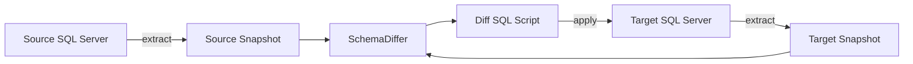
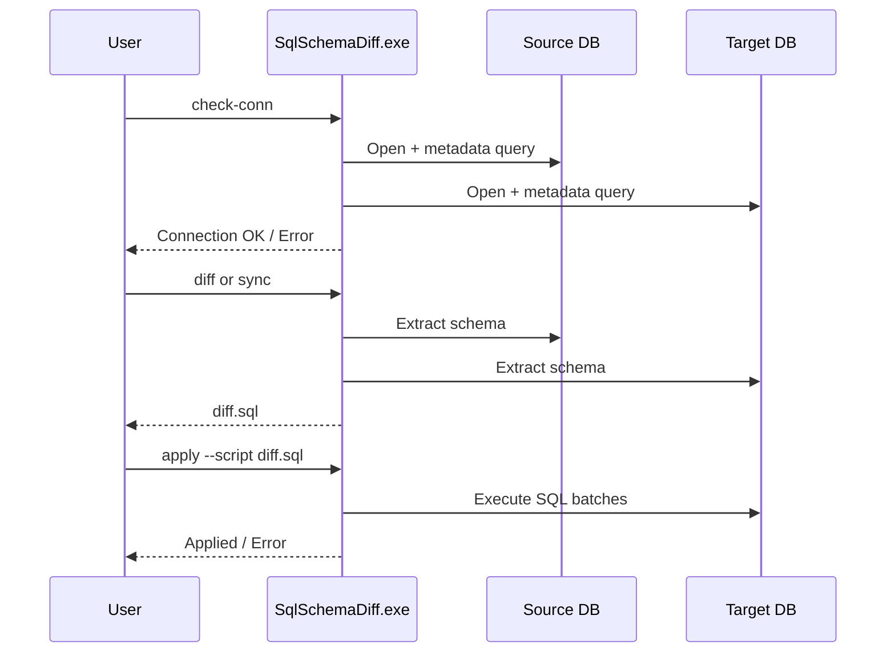

# SQLDiff CLI (.NET 9)

SQLDiff is a SQL Server schema synchronization CLI.

Primary goals:
- Extract schema from a source database.
- Compare source vs target.
- Generate safe migration SQL.
- Apply only what is needed on target.

This README is **EXE-first** for client/server operations.

## 1) Quick Start (EXE)

Assumption: you are in the folder where `SqlSchemaDiff.exe` is located.

```powershell
.\SqlSchemaDiff.exe --help
```

Important command syntax:
- Correct: `SqlSchemaDiff.exe extract ...`
- Incorrect: `SqlSchemaDiff.exe -- extract ...`

## 2) Architecture (Mermaid)



## 3) Operation Flow (Mermaid)



## 4) Supported Schema Objects

- Tables
  - Columns (identity, computed, defaults, collation, nullable)
  - PK / UQ
  - FK
  - CHECK
  - Indexes
- Views
- Stored procedures
- Functions (scalar + table-valued)

## 4.1) Dependency-Aware Ordering

When generating diff/sync scripts, SQLDiff now orders create/alter statements using dependency analysis:
- Table dependencies from foreign keys.
- Programmable object dependencies from SQL expression metadata.

This reduces failures caused by invalid creation order for related objects.
If a dependency cycle is detected, SQLDiff appends remaining objects in fallback order and emits a warning comment in the script.

## 5) Commands

### `extract`
```text
extract --conn <connectionString> [--out schema.sql] [--json snapshot.json]
```

### `diff`
```text
diff (--source-conn <cs> | --source-snapshot <json>)
     (--target-conn <cs> | --target-snapshot <json>)
     [--out diff.sql]
     [--include-drops]
     [--include-table-drops]
     [--allow-table-rebuild]
     [--add-only]
```

### `sync`
```text
sync (--source-conn <cs> | --source-snapshot <json>)
     (--target-conn <cs> | --target-snapshot <json>)
     [--out sync.diff.sql]
     [--include-drops]
     [--include-table-drops]
     [--allow-table-rebuild]
     [--add-only]
     [--apply]
     [--dry-run]
     [--timeout-seconds 120]
```

### `deploy` (new)
Single command for `diff + apply`.

```text
deploy (--source-conn <cs> | --source-snapshot <json>)
       --target-conn <cs>
       [--out deploy.diff.sql]
       [--include-drops]
       [--include-table-drops]
       [--allow-table-rebuild]
       [--add-only]
       [--dry-run]
       [--timeout-seconds 120]
```

`delta-apply` is available as an alias of `deploy`.

### `apply`
```text
apply --conn <connectionString> --script <diff.sql> [--dry-run] [--timeout-seconds 120]
```

### `check-conn`
```text
check-conn (--conn <cs> | --source-conn <cs> [--target-conn <cs>]) [--timeout-seconds 15]
```

### `drift`
```text
drift (--source-conn <cs> | --source-snapshot <json>)
      (--target-conn <cs> | --target-snapshot <json>)
      [--out drift.sql]
```

`drift` returns exit code `2` when differences are detected.

## 6) New Flag: `--add-only`

`--add-only` is designed for this scenario:
- Target already has some objects.
- You only want to create objects that are missing.
- You do not want alter/drop behavior.

Behavior:
- Includes only objects existing in source and missing in target.
- Skips changed existing objects.
- Ignores drop generation.

## 7) Recommended Client Workflow

### Step 1: Validate target connection
```powershell
.\SqlSchemaDiff.exe check-conn --conn "Data Source=PHXDEV\SQL2019;Initial Catalog=MonetPublisher;User Id=cubo;Password=***;TrustServerCertificate=True"
```

### Step 2 (Option A): Single command (`deploy`)
Use source snapshot (or source connection) against target and apply in one shot:

```powershell
.\SqlSchemaDiff.exe deploy `
  --source-snapshot .\source.snapshot.json `
  --target-conn "Data Source=PHXDEV\SQL2019;Initial Catalog=MonetPublisher;User Id=cubo;Password=***;TrustServerCertificate=True" `
  --out .\deploy.addonly.sql `
  --add-only
```

### Step 2 (Option B): Two-step (diff + apply)
Generate script first:

```powershell
.\SqlSchemaDiff.exe diff `
  --source-snapshot .\source.snapshot.json `
  --target-conn "Data Source=PHXDEV\SQL2019;Initial Catalog=MonetPublisher;User Id=cubo;Password=***;TrustServerCertificate=True" `
  --out .\delta.addonly.sql `
  --add-only
```

Then apply:

```powershell
.\SqlSchemaDiff.exe apply --conn "Data Source=PHXDEV\SQL2019;Initial Catalog=MonetPublisher;User Id=cubo;Password=***;TrustServerCertificate=True" --script .\delta.addonly.sql
```

## 8) Examples Catalog

### A. Help
```powershell
.\SqlSchemaDiff.exe --help
```

### B. Connection checks
```powershell
.\SqlSchemaDiff.exe check-conn --conn "Server=SQL1;Database=DbA;User Id=sa;Password=***;Encrypt=True;TrustServerCertificate=True"
```

```powershell
.\SqlSchemaDiff.exe check-conn `
  --source-conn "Server=SQL1;Database=DbA;..." `
  --target-conn "Server=SQL2;Database=DbA;..."
```

### C. Extract
```powershell
.\SqlSchemaDiff.exe extract `
  --conn "Server=SQL1;Database=DbA;..." `
  --out .\artifacts\source.sql `
  --json .\artifacts\source.snapshot.json
```

### D. Diff (standard)
```powershell
.\SqlSchemaDiff.exe diff `
  --source-conn "Server=SQL1;Database=DbA;..." `
  --target-conn "Server=SQL2;Database=DbA;..." `
  --out .\artifacts\diff.sql
```

### E. Diff (add only)
```powershell
.\SqlSchemaDiff.exe diff `
  --source-conn "Server=SQL1;Database=DbA;..." `
  --target-conn "Server=SQL2;Database=DbA;..." `
  --out .\artifacts\diff.addonly.sql `
  --add-only
```

### F. Sync + apply (add only)
```powershell
.\SqlSchemaDiff.exe sync `
  --source-conn "Server=SQL1;Database=DbA;..." `
  --target-conn "Server=SQL2;Database=DbA;..." `
  --out .\artifacts\sync.addonly.sql `
  --add-only `
  --apply
```

### G. Deploy in one command (add only)
```powershell
.\SqlSchemaDiff.exe deploy `
  --source-snapshot .\artifacts\source.snapshot.json `
  --target-conn "Server=SQL2;Database=DbA;..." `
  --out .\artifacts\deploy.addonly.sql `
  --add-only
```

### H. Apply SQL
```powershell
.\SqlSchemaDiff.exe apply `
  --conn "Server=SQL2;Database=DbA;..." `
  --script .\artifacts\diff.addonly.sql
```

### I. Drift in CI
```powershell
.\SqlSchemaDiff.exe drift `
  --source-conn "Server=SQL1;Database=DbA;..." `
  --target-conn "Server=SQL2;Database=DbA;..." `
  --out .\artifacts\drift.sql
```

## 9) Troubleshooting

### Error: `Comando no soportado: --`
Cause: command used as `SqlSchemaDiff.exe -- extract ...`.
Fix: remove the extra `--`.

Correct:
```powershell
SqlSchemaDiff.exe extract --conn "..." --out publish.sql
```

### Error: `There is already an object named 'X' in the database`
Cause: applying a full extract script (`publish.sql`) on a DB that already has objects.

Fix:
1. Generate diff SQL, not full extract.
2. Use `--add-only` when you only want missing objects.
3. Apply the resulting delta script.

```powershell
.\SqlSchemaDiff.exe diff --source-snapshot .\source.snapshot.json --target-conn "..." --out .\delta.sql --add-only
.\SqlSchemaDiff.exe apply --conn "..." --script .\delta.sql
```

Or use one command:

```powershell
.\SqlSchemaDiff.exe deploy --source-snapshot .\source.snapshot.json --target-conn "..." --out .\deploy.sql --add-only
```

### Related objects fail due to creation order
Cause: object dependencies are complex or cyclical.

Fix:
1. Regenerate script with current SQLDiff version (dependency-aware ordering).
2. Prefer `diff`/`sync` output over raw full extract for updates.
3. If needed, split cycles manually into two passes (base objects first, dependent objects second).

### TLS/certificate issues
- Use `Encrypt=True;TrustServerCertificate=True` for internal/dev setups.
- In production, use trusted certificates.

### Timeout during apply
- Increase timeout:
```powershell
.\SqlSchemaDiff.exe apply --conn "..." --script .\delta.sql --timeout-seconds 600
```

## 10) Exit Codes

- `0` success
- `1` error
- `2` drift detected (`drift` command)

## 11) Optional: Build and Publish From Source

```powershell
dotnet restore .\SqlSchemaDiff.csproj
dotnet build .\SqlSchemaDiff.csproj
dotnet publish .\SqlSchemaDiff.csproj -c Release -r win-x64 --self-contained true /p:PublishSingleFile=true
```
