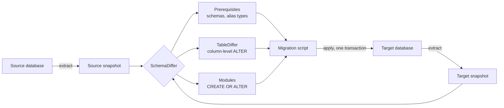

# 🔀 SQLDiff

[](https://github.com/peopleworks/SqlSchemaDiff/actions/workflows/ci.yml)
[](LICENSE)
[](https://dotnet.microsoft.com/)
[](https://www.microsoft.com/sql-server)
[](https://github.com/peopleworks/SqlSchemaDiff/releases)
[](https://github.com/peopleworks/SqlSchemaDiff/stargazers)

**Compare two SQL Server databases and generate the migration script that makes one
match the other — without dropping your tables.**

No SSDT project, no `.dacpac`, no SSMS, no license server. One command-line binary that
reads schema metadata, works out the difference, and writes T-SQL you can read before
you run it.

```bash
sqldiff deploy --source-conn "Server=dev;Database=App;..." \
               --target-conn "Server=prod;Database=App;..." \
               --out changes.sql
```

> **The generated script is the product.** `diff` never touches the target — it writes
> a file. Read it, put it in a pull request, hand it to a DBA. `deploy` is the same
> thing plus an apply, and the apply runs in one transaction that rolls back whole.
>
> A generated script is a **delta for one specific pair of databases**, so it is not
> meant to be re-run: applying it twice fails on the objects it already created. To
> bring a target up to date again, run `diff`/`deploy` again — against a target that
> already matches, it produces an empty script and does nothing.

---

## What it actually does

Point it at two databases. It emits `ALTER` statements that carry the target forward,
**preserving the rows that are already there.**

<details open>
<summary><b>A worked example</b> — widen a column, add a column, leave the rest alone</summary>

Source has an extra `Tier` column and a wider `Email`. Target has a `LegacyCode`
column of its own, one row of data, and an index sitting on the column being widened.

```sql
-- source                                    -- target
CREATE TABLE dbo.Customer(                   CREATE TABLE dbo.Customer(
  Id    int IDENTITY PRIMARY KEY,              Id         int IDENTITY PRIMARY KEY,
  Name  nvarchar(100) NOT NULL,                Name       nvarchar(100) NOT NULL,
  Email varchar(256) NULL,                     Email      varchar(80) NULL,
  Tier  tinyint NOT NULL DEFAULT (1));         LegacyCode char(4) NULL);
CREATE INDEX IX_Customer_Email                CREATE INDEX IX_Customer_Email
  ON dbo.Customer(Email);                       ON dbo.Customer(Email);
```

```console
$ sqldiff diff --source-conn "...DemoSrc..." --target-conn "...DemoDst..." --out demo.sql
Diff SQL written to: /work/demo.sql
Summary: added=0, changed=1, removed=0, skipped=0
  Changed (1): [dbo].[Customer]
```

```sql
-- demo.sql
SET ANSI_NULLS ON;
SET QUOTED_IDENTIFIER ON;
GO

-- ALTER [dbo].[Customer] (column-level sync)
-- WARNING: column [LegacyCode] exists only on target and was not dropped. Use --include-drops to remove it.
DROP INDEX [IX_Customer_Email] ON [dbo].[Customer];
GO
ALTER TABLE [dbo].[Customer] ADD [Tier] tinyint NOT NULL CONSTRAINT [DF_Customer_Tier] DEFAULT ((1));
GO
ALTER TABLE [dbo].[Customer] ALTER COLUMN [Email] varchar(256) COLLATE SQL_Latin1_General_CP1_CI_AS NULL;
GO
CREATE NONCLUSTERED INDEX [IX_Customer_Email] ON [dbo].[Customer] ([Email] ASC);
GO
```

Four things worth noticing, because they are the whole point:

1. **No `DROP TABLE`.** The row in the target survives, and `Tier` is backfilled by its
   default.
2. **The index came down and went back up.** SQL Server refuses `ALTER COLUMN` while an
   index references the column — so the index is dropped before and recreated after,
   even though the index itself is not changing.
3. **`LegacyCode` was left alone**, with a comment saying so. Destructive operations
   need `--include-drops`; silence is never the answer.
4. **The `SET` options are there** so the script also runs correctly through `sqlcmd`
   and SSMS, which do not inherit them.

</details>

## Install

**Download a binary** — [Releases](https://github.com/peopleworks/SqlSchemaDiff/releases)
carries a self-contained `sqldiff` for Windows and Linux. Nothing to install alongside
it; the .NET runtime is bundled.

**Or build it** — needs the [.NET 9 SDK](https://dotnet.microsoft.com/download):

```bash
git clone https://github.com/peopleworks/SqlSchemaDiff.git
cd SqlSchemaDiff
dotnet build SqlSchemaDiff.csproj -c Release
dotnet bin/Release/net9.0/sqldiff.dll --help
```

**Or as a .NET global tool** — the project packs as one, and the release workflow
publishes it when a `NUGET_API_KEY` secret is present:

```bash
dotnet tool install --global SqlSchemaDiff   # installs the `sqldiff` command
```

Runs on Windows, Linux and macOS. Works against **SQL Server 2016 and newer**, any
edition — Developer, Express and Azure SQL included.

## The commands

| Command | What it does |
|---|---|
| `check-conn` | Verify a connection and print server, database, login, version, edition. |
| `extract` | Script a whole database to `.sql`, and optionally a `.json` snapshot. |
| `diff` | Compare source against target, write the migration script. **Never touches the target.** |
| `apply` | Run an existing script against a database, in one transaction. |
| `deploy` | `diff` + `apply` in one step. `sync` is the same with an explicit `--apply`. |
| `drift` | Like `diff`, but **exits 2** when anything differs. Built for CI. |

Run `sqldiff --help` for the full option list.

### The usual sequence

```bash
# 1. Make sure you can reach both sides.
sqldiff check-conn --source-conn "$DEV" --target-conn "$PROD"

# 2. Write the script — nothing is applied.
sqldiff diff --source-conn "$DEV" --target-conn "$PROD" --out changes.sql

# 3. Read changes.sql. This is the step that matters.

# 4. Apply it.
sqldiff apply --conn "$PROD" --script changes.sql --log apply.log
```

### Snapshots: compare without both databases online

`extract --json` writes the source structure to a file. Commit it, ship it, diff against
it later — useful when the source is a developer machine and the target is a customer
server you reach once a month.

```bash
sqldiff extract --conn "$DEV" --out schema.sql --json schema.snapshot.json
sqldiff deploy  --source-snapshot schema.snapshot.json --target-conn "$CUSTOMER" --add-only
```

## Safety

This is a tool that writes DDL against databases with data in them, so the defaults lean
conservative.

- **One transaction.** `apply`, `sync` and `deploy` run every batch in a single
  transaction. If any batch fails, the whole change rolls back and the target is left
  exactly as it was. `--no-transaction` opts out.
- **Nothing is dropped unless you ask.** A column, constraint or index that exists only
  on the target is reported as a `-- WARNING:` comment and left in place. `--include-drops`
  enables dropping them; dropping whole tables needs `--include-table-drops` on top.
- **Tables are never rebuilt implicitly.** A changed table produces `ALTER` statements.
  `--allow-table-rebuild` is the only way to get `DROP`/`CREATE`, and it says plainly that
  it can lose data.
- **Risky changes are annotated in the script**, not buried in a log:

  ```sql
  -- WARNING: new column [Code] is NOT NULL without a default; ADD will fail if the table already has rows.
  -- WARNING: column [Status] becomes NOT NULL; ALTER fails if it contains NULLs. Backfill first.
  -- WARNING: column [Sku] type narrows (varchar(200) -> varchar(50)); review for data truncation.
  -- WARNING: column [Id] identity property differs and cannot be changed with ALTER COLUMN. Manual table rebuild required.
  ```

- **`--dry-run`** parses the script into batches and reports the count without executing.
- **`--add-only`** creates what is missing and changes nothing that exists — the safest
  mode for pushing new objects to a customer database.
- **`--log <file>`** appends an audit record per run: timestamp, server, database, script,
  batches executed, and the outcome (`applied` / `rolled-back` / `failed`). It records the
  server and database from the connection string, never the password.

## Connection strings

**A password typed as a command-line argument is not private.** Any other process on the
machine can read the full command line, your shell writes it to history, and most CI
runners echo it. SQLDiff takes the connection string three other ways:

```bash
sqldiff extract --conn-file ./prod.conn     # a file whose permissions you control
sqldiff extract --conn env:MY_CONN          # indirection through a named variable
SQLDIFF_CONN="Server=..." sqldiff extract   # the default variable
```

Both sides have the same three forms: `--source-conn` / `--source-conn-file` /
`SQLDIFF_SOURCE_CONN`, and `--target-conn` / `--target-conn-file` / `SQLDIFF_TARGET_CONN`.

On Windows, `Integrated Security=True` avoids a stored password entirely:

```text
Server=SQL1;Database=App;Integrated Security=True;Encrypt=True;TrustServerCertificate=True
```

`TrustServerCertificate=True` is for internal and development servers. In production, use a
certificate the client trusts.

## Drift detection in CI

`drift` exits **2** when the databases differ, **0** when they match — so a pipeline can
fail the build when production has quietly diverged from the schema in your repository.

```yaml
- name: Fail if production drifted from the committed schema
  run: |
    sqldiff drift \
      --source-snapshot schema.snapshot.json \
      --target-conn "$PROD_CONN" \
      --out drift.sql
  env:
    PROD_CONN: ${{ secrets.PROD_CONN }}
```

`drift` enables `--include-drops` and `--include-table-drops` by default, because its job
is to report *every* difference — including objects that exist only on the target. The
script it writes is a report; do not pipe it into `apply` without reading it.

## What it covers

| Supported | Not yet |
|---|---|
| Tables, columns, identity, computed & persisted columns, collation, defaults | Triggers, sequences, synonyms |
| Primary keys, unique constraints, check constraints, foreign keys | Table types, CLR types, assemblies |
| Indexes: clustered, nonclustered, unique, filtered, `INCLUDE`, `DESC` | Columnstore, XML, spatial and hash indexes *(reported, not scripted)* |
| Views, stored procedures, scalar and table-valued functions | Extended properties, permissions, users and roles |
| Schemas and user-defined alias types (as prerequisites) | Partition schemes and functions, filegroups |
| System-named constraints, matched by shape rather than by name | Temporal `SYSTEM_VERSIONING` clauses *(history tables are skipped)* |

Anything in the right-hand column is skipped rather than mangled, and the ones that could
matter for correctness are **reported on the console** rather than dropped silently:

```console
  NOTE: skipped index [CCI_Sales] on [dbo].[Sales]: unsupported index type CLUSTERED COLUMNSTORE
  NOTE: skipped [dbo].[EmployeeHistory]: temporal history table (managed by SQL Server)
```

**Column order is not drift.** Tables are compared structurally — columns, constraints and
indexes matched by identity, not by rendered text — so the same columns in a different
physical order compare equal. Reordering a column would require a destructive rebuild, so
it is deliberately ignored rather than reported forever.

## Two design decisions worth knowing about

**Constraints SQL Server named itself are matched by shape, not by name.** An unnamed
primary key gets a per-database random suffix — `PK__Orders__3214EC07CF883821` on one
database and `PK__Orders__3214EC073F741784` on another. Matching those by name makes every
database look permanently different and generates an `ADD CONSTRAINT` that fails. SQLDiff
matches them by the columns they cover and creates them without a name, letting the target
generate its own.

**Extraction reads the whole database in a fixed number of queries.** Metadata is fetched
with one set-based query per catalog view and grouped in memory, rather than a few queries
per table plus one per index. Measured on a 200-table, 600-index database: **1,430 queries
before, 11 after.** The saving scales with network latency, so it matters most when the
server is not on your machine.

## How it compares

| | SQLDiff | SSDT / DACPAC | Commercial tools |
|---|---|---|---|
| Cost | Free, MIT | Free | Paid, per seat |
| Needs a project file | No | Yes (`.sqlproj`) | No |
| Runs headless in CI | Yes, single binary | Yes, with the toolchain installed | Usually |
| Object coverage | Focused (see table above) | Very broad | Very broad |
| Generated script | Plain T-SQL you read first | Plain T-SQL | Plain T-SQL |

If you need full coverage of every SQL Server feature, use SSDT or a commercial tool — that
is what they are for. SQLDiff is for the common case: **keep the structure of a handful of
databases in step, from a script, without ceremony.**

## How it works


```mermaid
flowchart LR
    A[Source database] -->|extract| B[Source snapshot]
    C[Target database] -->|extract| D[Target snapshot]
    B --> E{SchemaDiffer}
    D --> E
    E --> P[Prerequisites<br/>schemas, alias types]
    E --> T[TableDiffer<br/>column-level ALTER]
    E --> M[Modules<br/>CREATE OR ALTER]
    P & T & M --> F[Migration script]
    F -->|apply, one transaction| C
```

Source layout:

```text
Models/       snapshot shapes (DatabaseSnapshot, TableModel, AliasTypeModel, ...)
Services/
  SqlServerSchemaExtractor   reads catalog views into a snapshot
  SqlRender                  renders every piece of SQL, shared by extract and diff
  SchemaDiffer               object-level diff, dependency ordering, prerequisites
  TableDiffer                column-level diff producing ALTER statements
  SqlModuleRewriter          CREATE -> CREATE OR ALTER, comment-aware
  SqlBatchExecutor           splits on GO, executes in one transaction
  ConnectionStringResolver   option / file / environment, and password masking
  AuditLogger                append-only record of every apply
tests/        xUnit; RegressionTests.cs pins each fixed bug to the error it caused
```

## Troubleshooting

<details>
<summary><code>There is already an object named 'X' in the database</code></summary>

You applied a **full extract** (`schema.sql`) to a database that already has objects. A
full extract is a create-from-nothing script. Use `diff` to generate a delta instead:

```bash
sqldiff diff --source-snapshot schema.snapshot.json --target-conn "$TARGET" --out delta.sql --add-only
sqldiff apply --conn "$TARGET" --script delta.sql
```
</details>

<details>
<summary><code>The specified schema name "app" either does not exist</code></summary>

Fixed in 1.3.0 — generated scripts now create the schemas they need. If you are applying a
script produced by an older version, regenerate it.
</details>

<details>
<summary>A changed table is skipped instead of synced</summary>

The snapshot JSON predates column-level sync and carries no structured table metadata.
Re-run `extract` with the current version so the snapshot includes the `Table` model, then
diff again. Live connections always use the current path.
</details>

<details>
<summary>Related objects fail because of creation order</summary>

SQLDiff orders creates by dependency — foreign keys for tables, `sys.sql_expression_dependencies`
for modules. A genuine cycle cannot be ordered; the script appends the remainder with a
warning comment, and you apply it twice or split it by hand.
</details>

<details>
<summary>Timeout while applying</summary>

`--timeout-seconds 600`. The default is 120 seconds per batch.
</details>

<details>
<summary><code>Unknown command: --</code></summary>

`sqldiff -- extract ...` — drop the stray `--`. The command comes first: `sqldiff extract ...`.
</details>

## Exit codes

| Code | Meaning |
|---|---|
| `0` | Success |
| `1` | Error — the message is on stderr |
| `2` | Drift detected (`drift` only) |

## Roadmap

- [x] Column-level `ALTER TABLE` that preserves data
- [x] Transactional apply with rollback, and an audit log
- [x] Schemas and alias types as script prerequisites
- [x] Credentials that stay off the command line
- [x] Packaging as a `dotnet tool`
- [ ] More object types: triggers, sequences, synonyms, table types
- [ ] Extended properties
- [ ] `--report` mode: a readable HTML diff alongside the script

Contributions are welcome — [CONTRIBUTING.md](CONTRIBUTING.md) has the setup, the house
style, and the two gotchas that have caused most of the bugs in this codebase.

## Changelog

See [CHANGELOG.md](CHANGELOG.md). Version 1.3.0 is an audit release: nine defects that
each produced a real SQL Server error, every one reproduced before it was fixed and pinned
by a regression test.

## Security

See [SECURITY.md](SECURITY.md) for how to report a vulnerability, how credentials are
handled, and exactly what SQLDiff writes to disk.

---

## Credits

Created by **Pedro Hernández — PeopleWorks**,
[Microsoft MVP for .NET](https://mvp.microsoft.com/en-US/mvp/profile/24060a02-dbc6-44ec-bca5-c213ff9835c5).

Built for the .NET and SQL Server community — *por y para la comunidad de desarrolladores.*

Repo: <https://github.com/peopleworks/SqlSchemaDiff>

Licensed under the [MIT License](LICENSE).

<p align="center">
  <sub><b>SQLDiff</b> • SQL Server schema sync for real-world deployments</sub>
</p>
